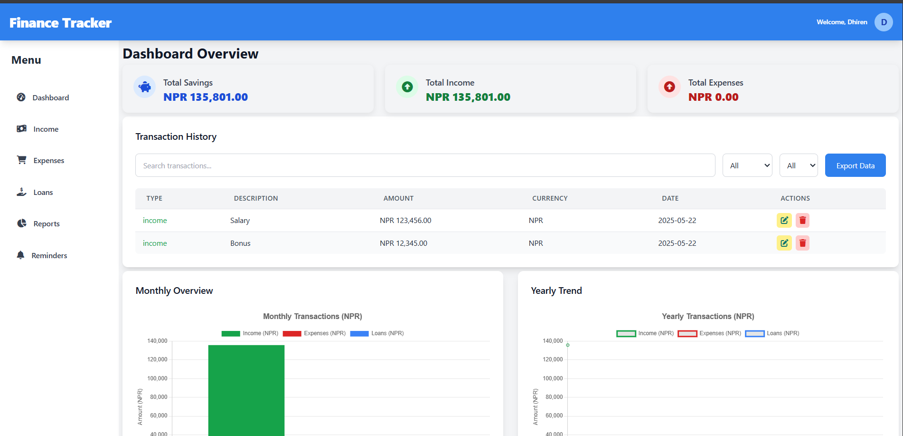

# 💰 Finance Tracker 

**Finance Tracker** is a modern, full-featured personal finance management web application. It helps you track income, expenses, loans, and set reminders for financial goals. With dynamic dashboards, filtering, currency conversion, and charts, it offers a complete view of your financial health.



---

## 📦 Features

### ✅ Core Modules
- **Dashboard Overview**: Track total savings, income, and expenses.
- **Transactions Management**: Add, edit, delete entries for:
  - Income
  - Expenses
  - Loans/Borrowings/Dues
- **Reports & Analytics**:
  - Monthly and yearly graphs (via Chart.js)
  - Generate and export detailed CSV reports
- **Reminders**:
  - Set reminders for future expenses or repayments
  - Auto-alerts for due items

### 💱 Currency Support
- Supports: **USD**, **NPR**, **KRW**
- Built-in conversion with predefined rates (can be expanded to real-time API)

---

## 🌐 Technologies Used

| Layer         | Tech Stack                          |
|---------------|-------------------------------------|
| Frontend      | HTML5, Tailwind CSS, JavaScript (OOP) |
| Charts        | Chart.js                            |
| Icons         | Font Awesome                        |
| Backend       | PHP (Modular scripts per feature)   |
| Database      | MySQL (via `db.php` connection)     |

---

## 🚀 Getting Started

### 1. Clone the Repository
```bash
git clone https://github.com/your-username/finance-tracker-pro.git
cd finance-tracker-pro
